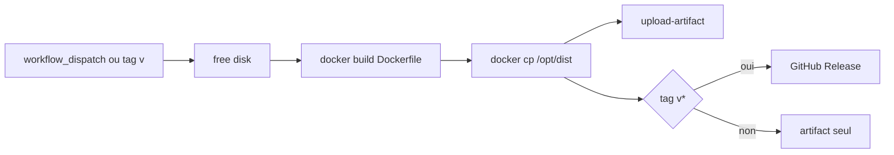

# CI GitHub Actions → Release WASM

Plan produit : publier les artefacts `dist/` produits par le build Docker local via GitHub Actions, puis les joindre à une GitHub Release sur tag `v*`.

## Verdict

Le chemin local (`docker build` → copier `/opt/dist`) est reproductible sur `ubuntu-latest`. Les artefacts (~13 MB `occt-step.wasm` + JS + licences) tiennent dans les limites Release. Le risque principal n’est pas le packaging, mais **durée / disque** d’un build OCCT froid (`timeout-minutes: 360`, parallélisme `-j2` dans le Dockerfile).

## Flux cible

| Déclencheur | Sortie |
|-------------|--------|
| `workflow_dispatch` | Artifact Actions `occt-step-wasm` (validation / debug) |
| Push tag `v*` (ex. `v0.1.0`) sur un commit de **`main`** | Même artifact + **GitHub Release publiée** avec les fichiers `dist/` |

Les tags hors `main` font échouer l’étape Release (voir [gitflow.md](gitflow.md)).

Hors scope de ce plan : smoke CI, cache Docker, publish npm, self-hosted runner.

## Source de vérité

Le workflow actif est [`.github/workflows/build-wasm.yml`](../.github/workflows/build-wasm.yml).

Le fichier [`ci/build-wasm.yml`](../ci/build-wasm.yml) est un miroir pour consultation hors `.github` (certains jetons sans scope `workflow` ne peuvent pas pousser sous `.github/workflows`). En cas d’écart, c’est `.github/workflows` qui prime.

## Artefacts de release

Joindre à la release :

- `dist/occt-step.wasm`
- `dist/occt-step.js`
- `dist/link-libs.txt`
- `dist/LICENSE_LGPL_21.txt`
- `dist/OCCT_LGPL_EXCEPTION.txt`

Notes de release : tag + SHA court. Pas de changelog généré. Permission job : `contents: write`.

## Robustesse

- Step free-disk avant `docker build` (toolchains GHA inutiles).
- Pas de cache Docker en V1 ; à revoir si les runs sont trop lents.
- Conserver `timeout-minutes: 360` et le `-j2` du Dockerfile.

## Validation

1. Push du workflow → `workflow_dispatch` → vérifier l’artifact.
2. `git tag v0.1.0 && git push origin v0.1.0` → vérifier la page Releases.

## Sprint

Backlog et tickets : [sprint-ci-release.md](sprint-ci-release.md).
