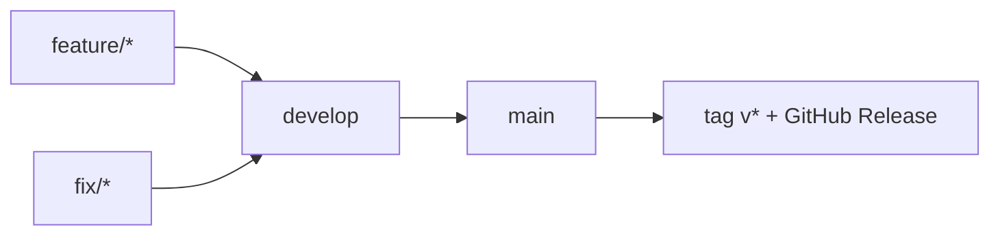

# Gitflow

Flux de branches du dépôt :

```text
feature/* | fix/*  →  develop  →  main  →  release (tag v*)
```



## Branches long-lived

| Branche | Rôle |
|---------|------|
| `develop` | Intégration. Cible par défaut des PR `feature/*` et `fix/*`. |
| `main` | Production. Reçoit uniquement des PR depuis `develop` (promotion). |

Branche par défaut GitHub : `main` (releases et tags).

## Branches de travail

| Préfixe | Usage | Merge dans |
|---------|--------|------------|
| `feature/<sujet>` | Nouvelle capacité | `develop` |
| `fix/<sujet>` | Correctif hors prod urgente | `develop` |

Pas de commits directs sur `develop` ni `main` (PR obligatoires via rulesets). Les admins du dépôt peuvent bypasser (rôle Repository admin) pour les urgences.

Definitions versionnées : [`.github/rulesets/`](../.github/rulesets/).

## Promotion et release

1. Intégrer les PR `feature/*` / `fix/*` dans `develop`.
2. Quand `develop` est prêt : PR `develop` → `main` (squash ou merge commit selon l’habitude du repo).
3. Sur `main`, créer le tag semver : `git tag v0.1.0 && git push origin v0.1.0`.
4. Le workflow [build-wasm](../.github/workflows/build-wasm.yml) construit le wasm et publie la GitHub Release (voir [ci-release.md](ci-release.md)).

Les tags `v*` ne sont valides que s’ils pointent un commit déjà sur `main`. Le job Release vérifie cette condition.

## Hors modèle (volontairement)

- Pas de branches `release/*` ni `hotfix/*` pour l’instant.
- Correctif urgent prod : `fix/*` → `develop` → PR rapide vers `main` → tag.
- Branche locale historique `publish` : ne fait pas partie du flux ; préférer `feature/*` / `fix/*` depuis `develop`.

## Commandes usuelles

```bash
git fetch origin
git checkout develop
git pull origin develop

git checkout -b feature/ma-feature
# … commits …
git push -u origin HEAD
# ouvrir une PR vers develop

# promotion
# PR develop → main, puis :
git checkout main
git pull origin main
git tag v0.1.0
git push origin v0.1.0
```
