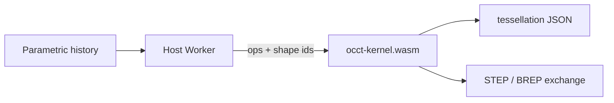

# OCCT Kernel WASM — plan d’évolution

Exposer un noyau de modélisation B-Rep en WebAssembly, en plus du lecteur STEP PMI actuel.

Contrat d’API détaillé : [kernel-api.md](kernel-api.md).  
Sprint : [sprint-kernel.md](sprint-kernel.md).

## Constat

`@naanouff/occt-wasm` n’expose aujourd’hui que `_occt_read_step` / `_occt_free` ([`src/occt_step_reader.cpp`](../src/occt_step_reader.cpp)).

[`scripts/configure-occt.sh`](../scripts/configure-occt.sh) compile déjà **ModelingData** et **ModelingAlgorithms** (plus DataExchange). Le wasm ~13 MB contient une grande partie du code utile ; **ce qui manque est la surface C/JS** (session, handles, opérations), pas un rebuild OCCT depuis zéro.

## Doctrine (consommateur OpenCAD)

| Artefact | Rôle |
|----------|------|
| Historique paramétrique (ex. `.cadompart`) | Vérité — hors de cette lib |
| Handles / shapes kernel (ex. `.cadombrep` cache) | Solide exact dérivé, éphémère ou cache |
| STEP / BREP | Import / export d’échange uniquement |

OCCT calcule ; l’historique reste hors bande. Utiliser STEP comme document de travail contredit cette doctrine.



## Décision d’architecture

**Deux artefacts WASM** partageant le même install OCCT statique (`/opt/occt`) :

| Artefact | Rôle | API |
|----------|------|-----|
| `occt-step` (existant) | Lecteur STEPCAF + PMI / mesh | inchangé |
| `occt-kernel` (nouveau) | Modélisation + tessellation + STEP/BREP échange | handles + ops |

Pourquoi séparer : le reader PMI reste stable ; le kernel évolue (exports, smoke, taille) sans casser les consommateurs STEP-only. Un seul build Docker produit les deux.

**Style d’API** : arena de shapes, handles `uint32` opaques, ops synchrones C++, mesh JSON (presets coarse/normal/fine), erreurs `{ "ok": false, "error", "code" }`. Pattern d’exports Emscripten comme l’existant ; `cwrap` ajouté aux runtime methods pour l’ergonomie JS.

Hors scope de cette lib : GCS / sketches / feature tree. Le kernel accepte des **wires déjà résolus**.

`TKOpenGl` reste interdit (Visualization / FreeType off).

## Phases

| Phase | Livrable | Critère de done |
|-------|----------|-----------------|
| 0 | Contrat [kernel-api.md](kernel-api.md) | Ops, codes d’erreur, invariants documentés |
| 1 | Target `occt-kernel` : arena, primitives, tessellate | Smoke box → mesh ; `GAPS-kernel.md` |
| 2 | Wire / face / extrude / revolve / booléens | Smoke profil → extrude → cut |
| 3 | Fillet / chamfer + list edges/faces | Indices shape-locaux documentés |
| 4 | Import/export STEP + BREP | Échange / cache uniquement |
| 5 | Packaging npm dual + CI/Release | Exports `./step` et `./kernel` ; release joint les deux |
| 6 | Worker : batch ops, typings, exemple | Init / mémoire documentés |

Ordre : `0 → 1 → 2 → 3 → 4 → 5 → 6`. Chaque phase = PR `feature/*` → `develop`, smoke vert.

## Budget taille

Tracker dans `dist/GAPS-kernel.md` (écrit par `npm run smoke:kernel`).  
Tant que le link reste « full `OpenCASCADE_LIBRARIES` », viser un kernel de l’ordre de **1.2–1.5×** le wasm step (`GAPS.md`). Link sélectif par TK (`TKBO`, `TKFillet`, `TKPrim`, …) : optimisation ultérieure, hors chemin critique v1.

## Packaging

```js
import createOcctStep from '@naanouff/occt-wasm/step';
import createOcctKernel from '@naanouff/occt-wasm/kernel';
```

Release `v*` joint step + kernel (voir [ci-release.md](ci-release.md)).

## Hors scope

- Solveur de contraintes 2D (GCS)
- Feature tree / expressions / document paramétrique
- Visualisation OCCT (`TKOpenGl`)
- PMI writer / `MODEL_GEOMETRIC_VIEW`
- Remplacement du reader STEP actuel
